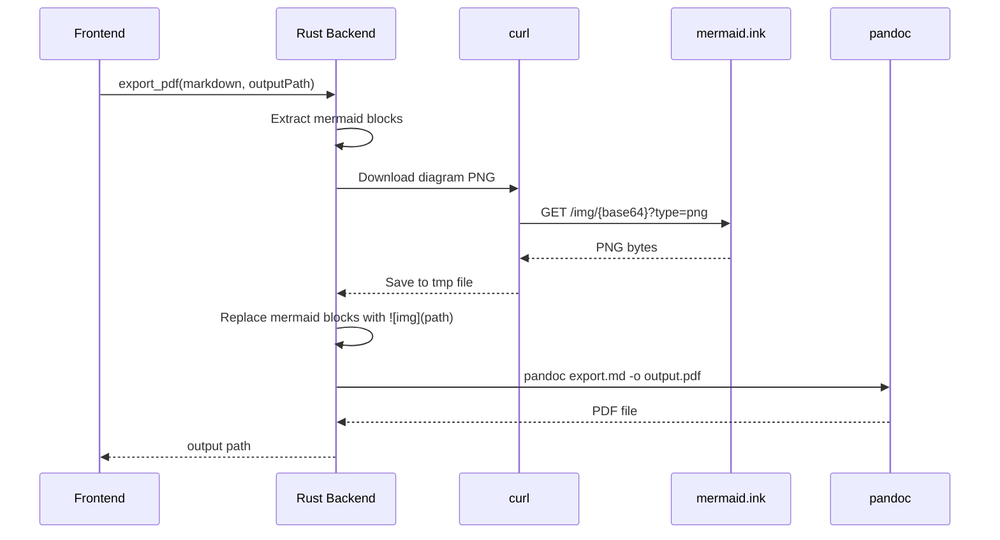

# 04-pdf-export

PDF export converts markdown to PDF via Pandoc with LaTeX. Mermaid diagrams are pre-rendered to PNG via the mermaid.ink API before Pandoc processing.

## System Diagram

## 1. Mermaid Pre-rendering

Mermaid code blocks are extracted from markdown, base64-encoded (custom encoder in `base64_encode()`), and fetched as PNG from `mermaid.ink`. Images saved to `$TMPDIR/mx_export/diagram_N.png`. On failure, falls back to plain code block.

## 2. Pandoc Pipeline

| Setting | Value |
|---------|-------|
| Engine priority | xelatex → pdflatex (fallback) |
| Margins | 1 inch |
| Font size | 11pt |
| xelatex fonts | Helvetica (main), Menlo (mono) |
| Color links | true |
| PATH | `/Library/TeX/texbin:/opt/anaconda3/bin:/usr/local/bin:/usr/bin:/bin` |

## 3. External Dependencies

| Tool | Required | Purpose |
|------|----------|---------|
| pandoc | Yes | Markdown → PDF conversion |
| xelatex or pdflatex | Yes | LaTeX PDF engine |
| curl | Yes | Download mermaid diagrams |
| Internet | Optional | mermaid.ink API for diagrams |

## 4. UI Feedback

Status bar shows progress: "Exporting PDF..." (blue) → "PDF saved: filename" (green, 3s) or "PDF failed: error" (red, 5s).

## File Reference

| File | Purpose |
|------|---------|
| `src-tauri/src/lib.rs:90-112` | `base64_encode()` |
| `src-tauri/src/lib.rs:114-227` | `export_pdf()` command |
| `src/main.ts:401-446` | Frontend `exportPDF()` UI handler |

## Cross-References

| Doc | Relation |
|-----|----------|
| [02-preview-pipeline](02-preview-pipeline.md) | Different Mermaid rendering path |
| [03-file-operations](03-file-operations.md) | Shared file I/O patterns |
| [05-ui-layout](05-ui-layout.md) | PDF button in toolbar |
